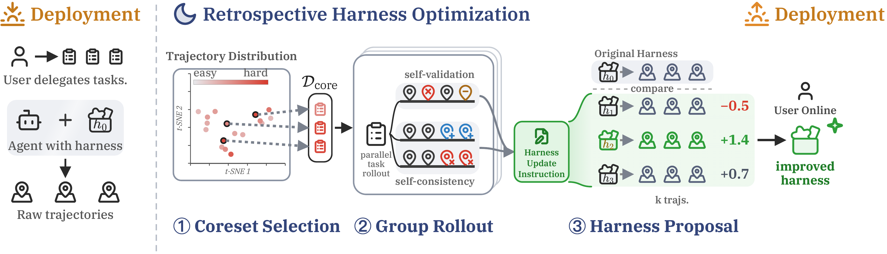
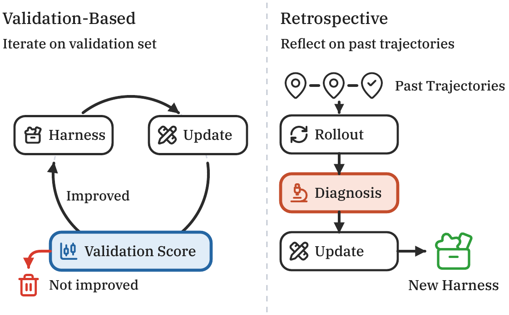

# Evolving Agents in the Dark

**Retrospective Harness Optimization (RHO) via Self-Preference**

<p align="center">
  <a href="https://arxiv.org/abs/2606.05922"></a>
  <a href="https://paper-rho.wenbo.io"></a>
  <a href="LICENSE"></a>
  
</p>

<p align="center">
  
</p>

> **TL;DR** — AI agents rely on a *harness* of skills, tools, and workflows to solve complex tasks.
> **RHO** improves that harness **without any ground-truth labels or validation set** — it learns purely
> from the agent's own past trajectories. A single retrospective pass lifts SWE-Bench Pro pass rate
> from **59% → 78%**.

---

## What is RHO?

Most harness-optimization methods (prompt optimization, skill/tool synthesis, agent search) iterate
against a *labeled validation set*. In real deployments such labels are expensive or impossible to
collect — but a deployed agent continuously produces a rich stream of **unlabeled trajectories**.

RHO turns those trajectories into harness improvements with **no external grading**, in three stages:

1. **Coreset Selection** — pick a small, difficulty-diverse subset of past tasks with a determinantal
   point process (DPP).
2. **Group Rollout** — re-solve each coreset task *G* times in parallel, then extract two
   label-free diagnostic signals: **self-validation** (within a trajectory) and **self-consistency**
   (across parallel trajectories).
3. **Harness Proposal** — sample *N* candidate harness edits and keep the one whose rollouts are most
   preferred by the agent's own **pairwise self-preference**.

<p align="center">
  
</p>

## Results

Held-out pass rate after a single optimization round (Codex + GPT-5.5), versus feedback-free baselines
that operate under the same agent-call budget:

| Method | Harness surface | SWE-Bench Pro | Terminal-Bench 2 | GAIA-2 |
| :-- | :-- | :--: | :--: | :--: |
| Vanilla Codex | — | 0.59 | 0.71 | 0.29 |
| Dynamic Cheatsheet | Skills | 0.62&nbsp;(+0.03) | 0.73&nbsp;(+0.02) | 0.30&nbsp;(+0.01) |
| ReasoningBank | Memory | 0.61&nbsp;(+0.02) | 0.73&nbsp;(+0.02) | 0.28&nbsp;(−0.01) |
| Sleep-time Compute | Memory | 0.64&nbsp;(+0.05) | 0.73&nbsp;(+0.02) | 0.32&nbsp;(+0.03) |
| **RHO (ours)** | **Skills + Tools** | **0.78&nbsp;(+0.19)** | **0.76&nbsp;(+0.05)** | **0.37&nbsp;(+0.08)** |

RHO also surpasses **Meta-Harness**, a *validation-feedback* optimizer, at a matched single-round budget
(0.78 vs 0.62 on SWE-Bench Pro) — without ever touching ground-truth labels.

## Install

The project uses [`uv`](https://docs.astral.sh/uv/).

```bash
git clone https://github.com/wbopan/retro-harness.git
cd retro-harness
uv sync                       # core dependencies
uv sync --extra swebench-pro  # + a dataset extra you want to run
```

RHO drives the [Codex CLI](https://github.com/openai/codex) as its base agent. Point it at a model
backend by copying a config from [`configs/`](configs/) (e.g. `configs/codex.chatgpt-default.toml`)
and passing it via `--codex-config`.

## Quickstart

```bash
# Run one retrospective optimization round on a dataset's trajectory split,
# then grade the winning harness on the held-out split.
uv run rho evolve \
  --dataset locomo:data/locomo10.json \
  --rounds 1 \
  --codex-config configs/codex.chatgpt-default.toml

# Solve a single task with a given harness
uv run rho solve --dataset <ds> --task <id> --harness <dir> --run-dir runs/demo

# Browse runs (prompts, completions, trajectories, harness diffs) in a web UI
uv run rho ui
```

Every run persists prompts, completions, trajectories, diagnoses, candidate harnesses, harness diffs,
configs, scores, and held-out reports under `runs/<timestamp>-<dataset>/`. See the full command
reference in [`docs/cli-help.md`](docs/cli-help.md).

## Repository layout

```
src/rho/
├── loop.py            # the RHO evolution loop (select → rollout → propose)
├── protocols.py       # typing.Protocol interfaces (Dataset, Harness, Task, TrajectoryStore, …)
├── selection/         # coreset selection (DPP, coverage, difficulty)
├── strategies/        # harness-proposal strategies + feedback-free baselines
├── orchestrators/     # solve / group-rollout orchestration
├── datasets/          # SWE-Bench Pro, Terminal-Bench 2, GAIA-2, LOCOMO loaders
├── reasoningbank/     # ReasoningBank baseline
├── meta_harness/      # Meta-Harness (validation-feedback) baseline
└── stores/            # trajectory + harness stores
configs/               # Codex CLI backend configs
scripts/               # figure-building & analysis scripts
webui/                 # run-browser frontend
tests/                 # hermetic + real-agent end-to-end tests
```

Implementations are decoupled behind `typing.Protocol` so components (selectors, strategies, datasets,
agents) can be swapped for ablations.

## Citation

```bibtex
@article{pan2026rho,
  title   = {Evolving Agents in the Dark: Retrospective Harness Optimization via Self-Preference},
  author  = {Pan, Wenbo and Liu, Shujie and Lin, Chin-Yew and Zeng, Jingying and Tang, Xianfeng and Zhou, Xiangyang and Lu, Yan and Jia, Xiaohua},
  journal = {arXiv preprint arXiv:2606.05922},
  year    = {2026}
}
```

## License

Released under the [MIT License](LICENSE).
